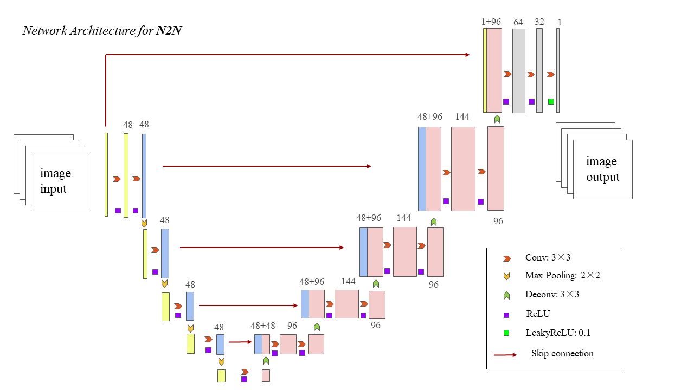
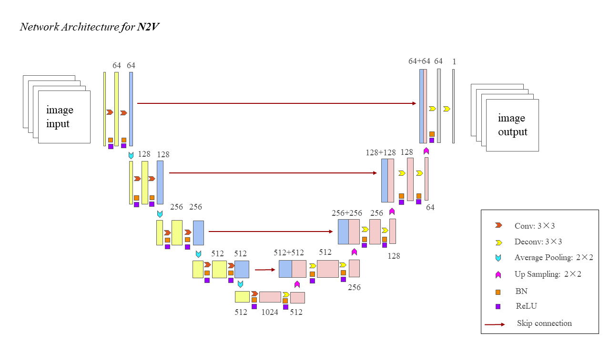
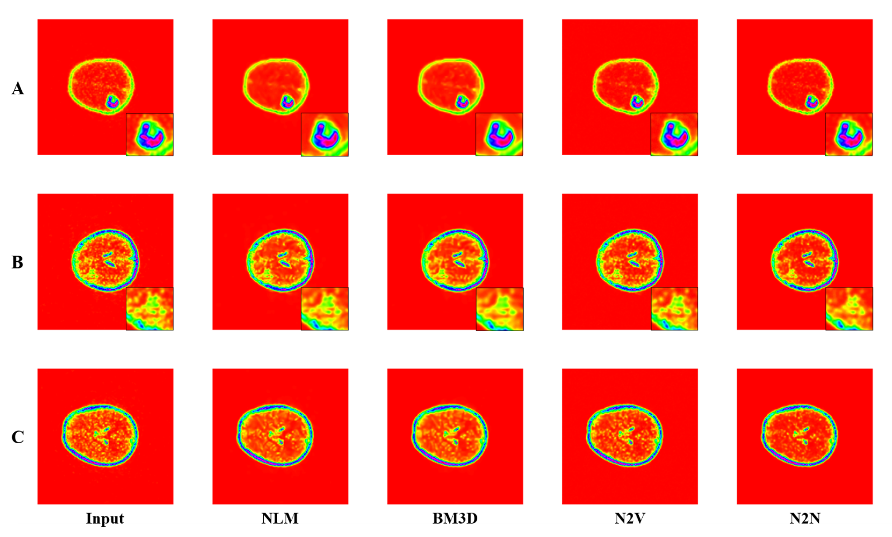

# CHO-PET-Denoise

by *[Shuo Xu](https://www.researchgate.net/profile/Shuo-Xu-21).
****

🔔 This is the code of [Applied Sciences-1666741]Deep Learning-Based Denoising in Brain Tumor CHO PET: Comparison with Traditional Approaches

🔔 The code includes four denoise algorithms：N2N, N2V, BM3D, NLM

****

## Code resources

In this study, we used some open source code. Thank these authors for their contributions

* [Noise2Noise](https://arxiv.org/abs/1803.04189) : [joeylitalien/noise2noise-pytorch](https://github.com/joeylitalien/noise2noise-pytorch)

* [Noise2Void](https://arxiv.org/abs/1811.10980) : [hanyoseob/pytorch-noise2void](https://github.com/hanyoseob/pytorch-noise2void)

* [BM3D](https://webpages.tuni.fi/foi/GCF-BM3D/) : [glemaitre/BM3D](https://github.com/glemaitre/BM3D)

* NLM

   We developed the NLM algorithm based on MATLAB, which uses integral image algorithm with memory optimization 

## Dataset
This was a retrospective investigation on a prospective CHO PET cohort which was approved by the Institutional Review Board of Peking Union Medical College Hospital (PUMCH) (ethics code ZS-2660), and informed consent was collected from all patients. Eligible criteria of the current study include: 

1) age ≥ 18 years and Karnofsky Performance Score (KPS) ≥ 70;
2) suspected of having primary brain tumor and planned for surgery; 
3) underwent head CHO PET/CT prior to surgery; 
4) histopatho-logical proved that the brain lesions to be primary diffuse glioma; 
5) no anti-tumor treatment prior to PET/CT or surgery. 

Finally, 39 patients with pathological-confirmed primary diffuse glioma were enrolled for CHO PET/CT and included in the current study. The data presented in this study are available on request from the corresponding author.

## Network architecture

use U-Net as backbone.
<table frame=void>
	<tr>		  
    <td>

</td>	
    <td>

</td>
    </tr>
</table>

## Results

## Acknowledgments

We would like to acknowledge [joeylitalien](https://joeylitalien.github.io//) for his [pytorch implementation of Noise2Noise](https://github.com/joeylitalien/noise2noise-pytorch) and [hanyoseob](https://github.com/hanyoseob) for his [pytorch implementation of Noise2Void](https://github.com/hanyoseob/pytorch-noise2void). 
